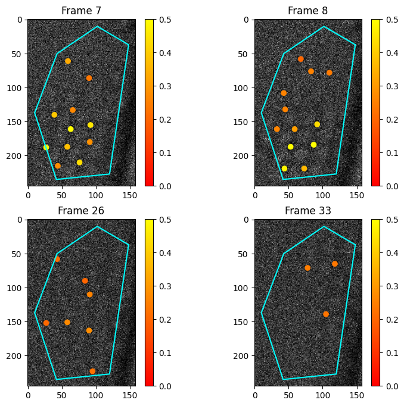
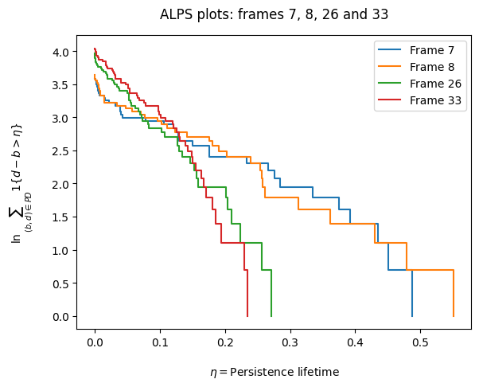
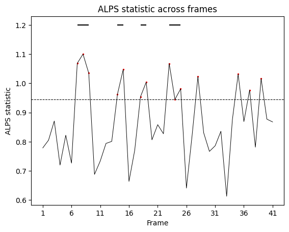

# Example `detecTDA` usage

In the below, <code>test_video.pkl</code> is the output of the "identify_polygon" python script, <br>
which allows choose your desired polygonal subregion. The video has been preprocessed so each frame is the sum of disjoint blocks of 16 consecutive frames in the original video[^1]. 

```python
import detectda as dtda
import pickle
import matplotlib.pyplot as plt
impol = dtda.ImageSeriesPickle('detectda/tests/test_video.pkl', div=32, n_jobs=2)
```

```{tip}
Here we divide each pixel by 32 (div=32) and round to the nearest integer because of various properties
of the detector which captured the video. Outside of hypothesis testing context, it is fine to set div equal to
its default value of div=1.
```


## Calculate persistent homology

Fit the persistence diagrams for every image in the polygonal region of the test video. We chose a smoothing parameter of 4 worked well for this very noisy nanoparticle video.

```python
impol.fit(sigma=4)
```


## Visualize the results of the fit

See where the persistence features are located and what their lifetimes are. Below, we see a few images with the points of the 0<sup>th</sup> persistence diagram overlaid, after removing points with lifetimes less than <code>thr</code>. 


```python
plt.figure(figsize=(9, 8))
fs = [6,7,25,32]
for i in range(4):
    plt.subplot(2, 2, i+1)
    plt.title("Frame "+str(fs[i]+1))
    impol.plot_im(fs[i], smooth=False, thr=0.2, vmin=0, vmax=0.5)
```
    

    

## Calculate and plot summaries

Run the `get_alps` method to calculate the ALPS statistic for each frame (cf. ALPS statistic calculation in the ["Example from <i>Science</i>"](rep_plot)). We can visualize the ALPS statistic with the following ALPS plot[^2], to see how the persistence lifetimes are distributed.

```python
impol.get_alps()
impol.alps_plot([6,7,25,32])
```




## Hypothesis testing and plotting

First, we load the video corresponding to the pixels in the vacuum region of the video. 

```python
G = open('detectda/tests/test_video_vacuum.pkl', 'rb')
tv_vacuum = pickle.load(G)['video']
```

Then, we run the hypothesis testing method described in [Section 5.3 of Thomas et al. (2023)](https://www.tandfonline.com/doi/full/10.1080/00401706.2023.2203744) using the observed image series above, by generating 499 Monte Carlo noise images.
 
```python 
impol_vac = dtda.VacuumSeries(tv_vacuum, observed_ImageSeries=impol, div=32, n_jobs=4)
impol_vac.fit(convert_to_int=True)
impol_vac.transform(499, "alps")
```

Finally, we plot the results of the hypothesis testing. The original image series consists of 656 frames, and the output here indicates there are quite a few 16-frame blocks with significant topological signal. 

```python
impol_vac.plot_hypo()
```



[^1]: Compare with [Section 5.3 of Thomas et al. (2023)](https://www.tandfonline.com/doi/full/10.1080/00401706.2023.2203744) where blocks of 5 frames were chosen in a higher signal-to-noise ratio context.

[^2]: The area under the curve for a given frame in the ALPS plot corresponds to the ALPS statistic---see Figure S6.3 in [Crozier et al. (2025)](https://www.science.org/doi/full/10.1126/science.ads2688).


